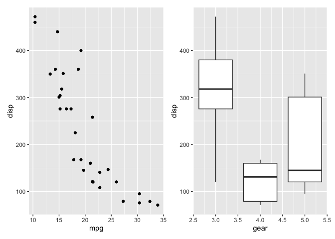

<!-- README.md is generated from README.Rmd. Please edit that file -->

# patchwork <a href='https://patchwork.data-imaginist.com'></a>

<!-- badges: start -->

[](https://github.com/thomasp85/patchwork/actions/workflows/R-CMD-check.yaml)
[](https://CRAN.R-project.org/package=patchwork)
[](https://CRAN.R-project.org/package=patchwork)
[](https://www.tidyverse.org/lifecycle/#experimental)
[](https://codecov.io/gh/thomasp85/patchwork?branch=main)
<!-- badges: end -->

The goal of `patchwork` is to make it ridiculously simple to combine
separate ggplots into the same graphic. As such it tries to solve the
same problem as `gridExtra::grid.arrange()` and `cowplot::plot_grid` but
using an API that incites exploration and iteration, and scales to
arbitrily complex layouts.

## Installation

You can install patchwork from CRAN using
`install.packages('patchwork')`. Alternatively you can grab the
development version from github using devtools:

``` r
# install.packages("devtools")
devtools::install_github("thomasp85/patchwork")
```

## Basic example

The usage of `patchwork` is simple: just add plots together!

``` r
library(ggplot2)
library(patchwork)

p1 <- ggplot(mtcars) + geom_point(aes(mpg, disp))
p2 <- ggplot(mtcars) + geom_boxplot(aes(gear, disp, group = gear))

p1 + p2
```

<!-- -->

patchwork provides rich support for arbitrarily complex layouts with
full alignment. As an example, check out this very readable code for
nesting three plots on top of a third:

``` r
p3 <- ggplot(mtcars) + geom_smooth(aes(disp, qsec))
p4 <- ggplot(mtcars) + geom_bar(aes(carb))

(p1 | p2 | p3) /
      p4
```

<!-- -->

## Learn more

patchwork can do so much more. Check out the guides for learning
everything there is to know about all the different features:

-   [Getting
    Started](https://patchwork.data-imaginist.com/articles/patchwork.html)
-   [Assembling
    Plots](https://patchwork.data-imaginist.com/articles/guides/assembly.html)
-   [Defining
    Layouts](https://patchwork.data-imaginist.com/articles/guides/layout.html)
-   [Adding
    Annotation](https://patchwork.data-imaginist.com/articles/guides/annotation.html)
-   [Aligning across
    pages](https://patchwork.data-imaginist.com/articles/guides/multipage.html)

## Code of Conduct

Please note that the patchwork project is released with a [Contributor
Code of
Conduct](https://patchwork.data-imaginist.com/CODE_OF_CONDUCT.html). By
contributing to this project, you agree to abide by its terms.
